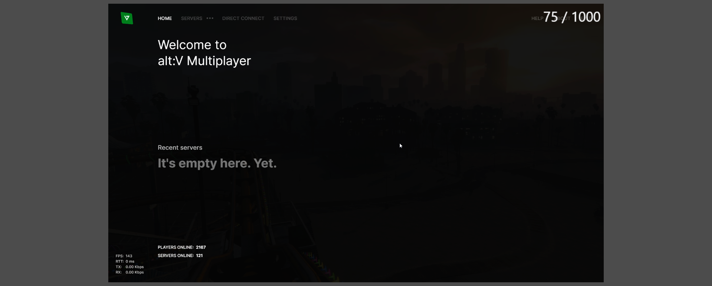
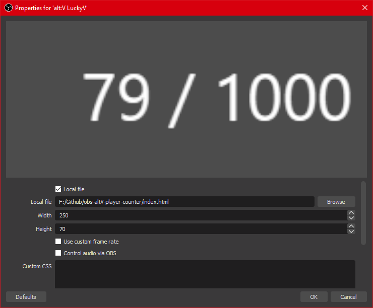
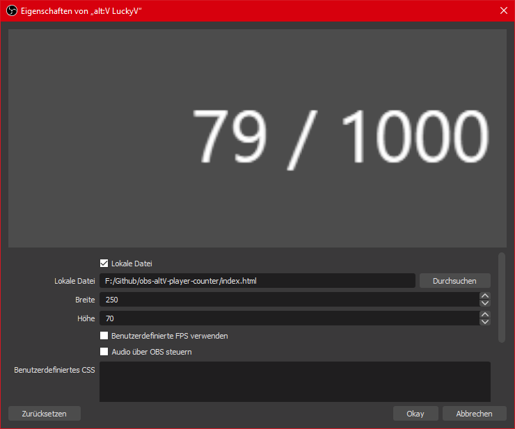

This HTML file can be used to display the player count of an [alt:V](https://altv.mp) Server while Streaming with the [Open Broadcaster Software](https://obsproject.com/).

# Preview

# Setup (EN)

Download the file `index.html` and save it somewhere.  
Open the file in Notepad and edit the `serverid` to the server that you want to display. (STRG + F: config)  
Now Open OBS and add a new Browser Source:  

Notice that you can edit the refresh time of the stats in the config. (STRG + F: config)  

# Setup (DE)

Lade die Datei `index.html` herunter und speicher sie irgendwo.  
Öffne die Datei jetzt in Notepad und bearbeite die alt:V Server ID. (STRG + F: config)  
Füge jetzt eine neue Browser-Quelle hinzu und nutze die folgenden Einstellungen:  

Beachte das du die Einstellung bearbeiten kannst wie oft die Daten neu geladen werden. (STRG + F: config)  
